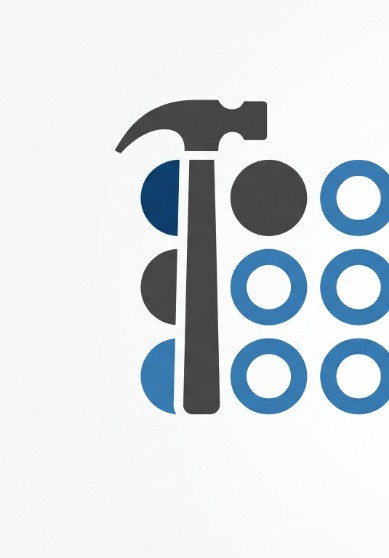

<p align="center">
  
</p>

<h1 align="center">SkillsForge</h1>

<p align="center">
  <strong>20% Change. 80% Better.</strong><br/>
  The Copilot skills harness that keeps pace with AI - structure, prove, and upgrade without rewriting everything.
</p>

<p align="center">
  <a href="https://github.com/avisheku/copilot-skills/actions"></a>
  
  
  
</p>

---

## Why SkillsForge

AI tools, models, and eval practices move weekly. Most skill packs rot quietly: tips go stale, sources drift, nobody can prove the harness beats solo Chat.

**SkillsForge** is an office-safe skills system for **GitHub Copilot** (and Claude Code). Small, deliberate upgrades — **20% change** — compound into an **80% better** agent workflow:

| Pillar | What you get |
|--------|----------------|
| **Structure** | Installable skills, graph, dual gates, MoA multi-agent path |
| **Proof** | Compare tracker (Elo / lift / cost) + instruction quality gate |
| **Pace** | `/upgrade` frontier scan — inventory, research checklist, promote via CI |

No silent auto-scrape. Upgrades are explicit, measurable, and merge-gated.

---

## Brand

| | |
|-|-|
| **Name** | SkillsForge (*skills-forge*) |
| **Mark** | Claw hammer + 3×3 skill grid |
| **Tagline** | 20% Change. 80% Better. |
| **Palette** | Skills `#1B3A6B` · Forge `#3D3D3D` · Deep `#0F1724` · Fog `#F4F6F8` |
| **Kit** | [`brand/`](brand/) — wordmark, mark SVG, banner, [COLORS](brand/COLORS.md) |

---

## Quick start

```powershell
# From the SkillsForge repo root
.\scripts\Install-CopilotSkills.ps1
```

Then in Copilot Chat:

| Command | Job |
|---------|-----|
| `/do` | Model-aware operator entry |
| `/2080` | Multi-role structured work |
| `/moa` | Mixture-of-Agents path |
| `/compare` | Prove harness vs solo |
| `/upgrade` | Frontier scan — what’s new / stale |
| `/learn` | Promote upgrades (CI-gated) |

Full install & VERIFY steps: **[docs/HANDBOOK.md](docs/HANDBOOK.md)**

---

## What ships (Phases 0–11)

```
Install → Graph & gates → Golden path → Learn/Audit
       → Loop/Research → MoA → Governance dashboard
       → Instruction quality (ICS) → Compare tracker → Frontier /upgrade
       → Living matrix (task × family × effort)
```

| Phase | Capability | Doc |
|------:|------------|-----|
| 6 | Mixture-of-Agents | [PHASE6](docs/plan/PHASE6_MOA.md) |
| 7 | Testability · observability · governance | [PHASE7](docs/plan/PHASE7_GOVERNANCE.md) |
| 8 | Instruction Contract Score | [PHASE8](docs/plan/PHASE8_QUALITY_GATE.md) |
| 9 | Harness compare (Elo / lift / $) | [PHASE9](docs/plan/PHASE9_COMPARE_TRACKER.md) |
| 10 | Upgrade / frontier scan | [PHASE10](docs/plan/PHASE10_UPGRADE.md) |
| 11 | Living matrix + ladder | [PHASE11](docs/plan/PHASE11_LIVING_MATRIX.md) |

**CI chain:** InstallSmoke → Phase2 → GoldenPath → Phase4–11  
**Defer list:** [docs/DEFER.md](docs/DEFER.md)

---

## Demo in two commands

**Prove the harness**

```powershell
.\scripts\Seed-CompareDemo.ps1
# open evidence\compare\report.html
```

**Stay current with AI**

```powershell
.\scripts\Invoke-UpgradeScan.ps1
# open evidence\upgrade\report.md
```

Local ops dashboard (after CI / gates): `evidence\dashboard.html`

---

## Skills at a glance

| Skill | Role |
|-------|------|
| `do` | Default operator |
| `2080` | Security / operator multi-role |
| `moa` | Propose → aggregate |
| `learn` | Upgrade-only promote |
| `audit` / `stats` | Health & ledger |
| `research` / `loop` | Depth & iteration |
| `compare` | Effectiveness evidence |
| `upgrade` | Frontier inventory + research checklist |
| `create` / `sync` / `mcp` / `magic` | Authoring, sync, MCP, aliases |

---

## Docs map

| Doc | Purpose |
|-----|---------|
| [HANDBOOK](docs/HANDBOOK.md) | Install, configure, troubleshoot |
| [CI](docs/CI.md) | GitHub Actions + merge protection |
| [ADR](docs/plan/ADR.md) | Architecture decisions |
| [Implementation plan](docs/plan/IMPLEMENTATION_PLAN.md) | Phases 0–11 |
| [SOURCES](docs/SOURCES.md) | Curated frontier links |
| [Brand kit](brand/README.md) | Logo · banner · colors |
| [SETUP](SETUP.md) | Setup pointer |

---

## Design principles (short)

1. **Gates over vibes** — CI must stay green; quality has a floor and a max-drop.
2. **Upgrade-only learn** — promote growth, reject silent shrink.
3. **Evidence on disk** — compare reports, upgrade scans, dashboard HTML.
4. **Human in the loop for research** — `/upgrade` inventories; agents research; you merge.

Constitution: [PILLARS](docs/PILLARS.md) · [PRINCIPLES](docs/PRINCIPLES.md)

---

## Stack

- **Primary:** Windows · PowerShell · VS Code / Insiders + GitHub Copilot Chat  
- **Also:** Claude Code (same `SKILL.md`)  
- **CI:** GitHub Actions · PowerShell gates  
- **Repo:** [avisheku/copilot-skills](https://github.com/avisheku/copilot-skills)

---

<p align="center">
  
  <br/>
  <sub>SkillsForge - 20% Change. 80% Better.</sub>
</p>
