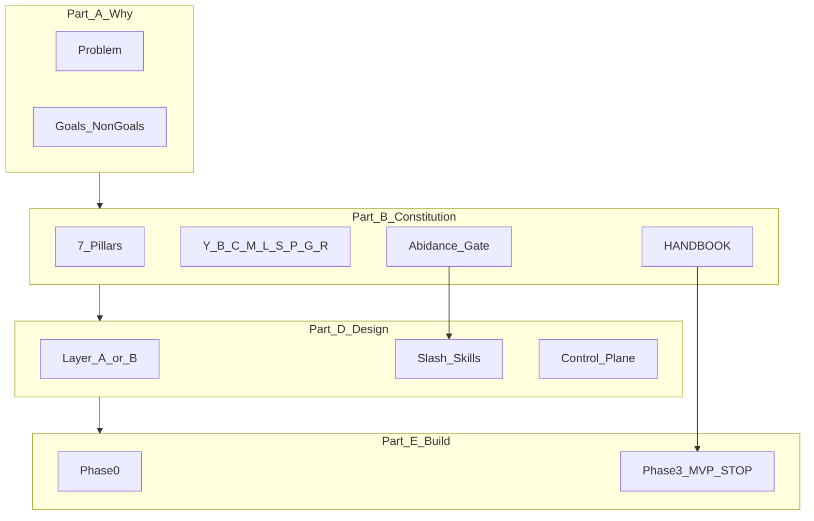
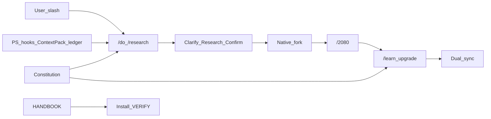

# Copilot Skills Pack — Solution Architecture & ADRs

| Field | Value |
|-------|-------|
| **Document type** | Solution Architecture + Architecture Decision Records (ADRs) + Implementation Plan |
| **Status** | LIVING (Phases 0–10 implemented; see ACCEPTANCE.md / DEFER.md) |
| **Version** | 1.1 |
| **Date** | 2026-07-12 |
| **Repo** | `C:\Users\avish\Documents\KnowledgeVault\projects\copilot-skills` |
| **Vault** | `C:\Users\avish\Documents\KnowledgeVault` |
| **Out of scope** | InstagramVault · ClaudeTrades product code |
| **Platform** | Windows primary · VS Code Copilot (MVP) · Claude Code (same SKILL.md) · Cursor (best-effort) |
| **Guide of record** | `docs/HANDBOOK.md` (living; AI + human; `/learn` upgrade-only) |
| **MVP stop** | Phase 3 golden path green → **STOP AND USE** |

**Abidance rule (locked):** Everything `/create`, `/learn`, `/2080`, sync, or handbook patch produces or promotes must pass the constitution. No “just this once.”

**How to proceed:** Say `accept OPEN defaults` (or list overrides) then `execute the plan` → Phase 0.

---

## 0. Document map

| Part | Sections | Purpose |
|------|----------|---------|
| **A — Why** | §1–§2 | Problem, goals, non-goals, requirement traceability |
| **B — Constitution** | §3 | Pillars, principles, policies, abidance, handbook |
| **C — ADRs** | §4 | Locked decisions with context / decision / consequences |
| **D — Solution design** | §5–§10 | Packaging, skills, control plane, context, learn, obs |
| **E — Implementation** | §11–§14 | Phases, golden path, success, risks |
| **F — Appendices** | A–D | ADOPT/DEFER, Ponytail, OPEN O1–O9, prior research |



---

# Part A — Why

## 1. Executive summary

Build one **shareable, office-safe skills harness** that makes VS Code Copilot (and Claude Code) behave like a professional agent system:

- **Deterministic control plane** (PowerShell + native hooks + ContextPack + JSONL ledger) behind thin slash skills  
- **Dual gates** before work: clarify → research → confirm → then implement  
- **Native** parallelism (fork/subagents), not a custom wave engine  
- **Model-aware** `/do` via official tip cards (config, not hardcode)  
- **Multi-role `/2080`** (20% effort → 80% gain) with essentials ladder  
- **Upgrade-only `/learn`**, dual sync (repo + global), searchable error-map  
- **Living HANDBOOK** so AI or a human can install, verify, troubleshoot, and recover smoothly  
- **Essential-only** builds (Ponytail-*inspired* ladder — cite, do not vendor)

User minimal work: org plugin check → run installer once (or ask Copilot to follow HANDBOOK) → fill `env/user.md`.



---

## 2. Goals, non-goals, requirement traceability

### 2.1 Goals (MVP)

1. Shareable pack; easy Copilot + Claude Code setup (Cursor best-effort).  
2. Deterministic backend behind prompts (PS, hooks, MCP profiles, ledger).  
3. Dual-gate `/do` / `/research`; model-aware; native parallel after confirm.  
4. `/2080` multi-role; thin `/learn` stub → full in Phase 4.  
5. Versioned composable blocks; add/kill/upgrade skill without merge pain.  
6. Searchable ledger; wastes/gotchas → error-map → never repeat.  
7. Constitution abidance on all created/promoted artifacts.  
8. Living HANDBOOK — AI/human install + troubleshoot; `/learn` can upgrade it.

### 2.2 Non-goals (REJECT)

- Vendoring ponytail / Superpowers / GSD / Conductor into office installs  
- SaaS observability as default  
- Always-on full MCP / memory / pack rules in Copilot global instructions  
- Custom wave/DAG engines or per-agent body-transform adapters  
- Degrade promotes · parallel before confirm · comment/noise farms  
- Overbuilding past E1–E7 / past Phase 3 without measured pain  

### 2.3 End-user 80/20 (E1–E7)

| # | Focus | Why |
|---|--------|-----|
| E1 | `/do` clarify→confirm→finish | Real work in one flow |
| E2 | Blank context + on-need rules | Fast chats |
| E3 | One install + `/sync -Check` | Trust upgrades |
| E4 | `/2080` multi-role | Continuous 20/80 improvement |
| E5 | Model tip cards on workers | Better output per model |
| E6 | Hooks + ledger (COMPAT fallback) | Safety + proof |
| E7 | Golden path = done | Stop overbuilding |

### 2.4 Requirement → architecture map

| Requirement | Lives in |
|-------------|----------|
| Pillars/principles; create/learn abide | §3 + abidance gate |
| Minimal comments; only required | Principle **M** + essentials ladder |
| Reusable, extensible, configurable, no hardcode | Pillar **2** + Principle **B** + config |
| Component/block builds | Principle **B** + skill mini-project |
| Code over vibes; AI for decisions only | Pillar **2** + control plane split |
| Caveman + token/context save; accuracy first | Pillar **3** + Principle **C** |
| Ponytail essentials; no overkill | Principle **Y** + Appendix A |
| Global setup; sync; Copilot + Claude | Pillar **1** + Layer A/B + `/sync` |
| Adaptive learn; upgrade never degrade | Pillar **6** + `/learn` |
| Model-agnostic + per-model strategy notes | `config/models/` + ADR-008 |
| Each command = mini-project README/SETUP | §5.2 |
| One shareable folder; easy setup | §5.1 + HANDBOOK |
| AI trends / innovative solutions | `docs/SOURCES.md` + `/learn -Sources` on ask |
| Clarify → research → confirm → implement | Pillar **4** + shared Gate module |
| Interconnectivity commands/files/prompts | `skills.graph.json` + `delegatesTo` + `shared/` |
| TOON / token wire | DEFER; MVP compact JSON |
| Official docs standards | Pillar **1** + COMPAT + catalog URLs |
| Add/kill/upgrade skill; PR-friendly | Principle **B** + L1/L2 + `/sync -Check` |
| Share knowledge; error/gotcha → fix → sync | error-map + `/learn` + dual sync |
| Backend (PS, MCP, hooks, …) | §7 |
| User prompts adjustable/optimized | `/learn` kinds + caveman + `/2080` |
| Root cause then fix | Principle **R** |
| Industry proven patterns | native > custom; official Agent Skills |
| Memory + time efficient | Pillars **3**, **5** + Principle **Y** |
| Troubleshooting / error-map | HANDBOOK + `learn/error-map/` |
| Audit, obs, searchable logs | JSONL ledger + `/stats` `/audit` |
| Issues must not repeat; testability | Pillar **6** + L1/L2 |
| Caveman prose “five” not `5` (narrative only) | Principle **C** never-touch |
| Parallelism / streams | Pillar **5** native fork |
| Professional presentable artifacts | Principle **P** |
| Handbook; AI/human install; learn updates | §3.5 |

---

# Part B — Constitution

## 3. Constitution (must abide)

### 3.1 Seven architecture pillars

| # | Pillar | One-liner | Decision test |
|---|--------|-----------|---------------|
| **1** | One standard, many harnesses | Official Agent Skills `SKILL.md`; adapters = paths/config only | Body-transform per agent? → **No** |
| **2** | Code over vibes | Deterministic PS/hooks/config; AI for judgment only | Logic only in prose? → **Codify** |
| **3** | Context thrift | Blank default; inject on need; no global dumps | Always-on full memory/rules? → **Reject** |
| **4** | Ask → confirm → finish | Clarify → research → ShortPlan confirm → implement | Build before confirm? → **No** |
| **5** | Parallel safe, sequential sacred | Native fork for independent work; sequential for gates/promote/secrets | Safety path parallel? → **No** |
| **6** | Measure → learn → promote | Ledger + tests; **upgrade-only**; root-cause; dual sync | Degrade / no evidence? → **Refuse** |
| **7** | Secrets stay local | User secrets/rules/env gitignored; hook deny when available | Leak? → **Block** |

**Conflict order (locked):**  
correctness > thrift · safety > speed · evidence > hype · lean > completeness · shared > forks · config > hardcode · **native > custom** · replaceable > monolith · upgrade > silent overwrite.

### 3.2 Operating principles

| ID | Principle | Meaning |
|----|-----------|---------|
| **Y** | Essential-only (Ponytail-inspired) | Need? → reuse? → native/stdlib? → dep? → one line? → **minimum that works**. Never cut security, validation, errors, a11y. Cite upstream; **do not vendor**. |
| **B** | Composable blocks | Skills/hooks/tips/modules/packs = versioned units; add/kill/upgrade/replace without rewriting harness |
| **C** | Caveman accurate | Terse agent prose; **correctness > terseness**; code/paths/errors/exact digits stay exact; “five” vs `5` only in narrative |
| **M** | Minimal surface | Only required files/comments/deps; no drive-by |
| **L** | Ship lean | MUST → SHOULD → DEFER → REJECT; stop after golden path |
| **S** | Slash over repetition | Prefer `/` + `delegatesTo` over redo/paste |
| **P** | Professional | README/SETUP/ACCEPTANCE/COMPAT; PR-ready |
| **G** | Compound growth | Playbooks; expert `/create`; global fixes help everyone |
| **R** | Root cause first | Reproduce → classify (error-map) → fix or `/learn` |

### 3.3 Capability policies (config, not prose)

| Policy | Path | Purpose |
|--------|------|---------|
| Model-aware | `config/models/` | Task→tier + official tip cards |
| `/2080` roles | `config/2080/` | Multi-role 20/80 |
| Essentials ladder | `config/essentials/ladder.md` | Ponytail-inspired rungs (our words) |
| Sources / frontier | `docs/SOURCES.md` + `config/research/sources.json` | Trends; `/learn -Sources` on ask |
| Rules / session / guardrails | `config/*-policy.json`, `guardrails.json` | Caps, merge order, danger patterns |
| Observability | ledger JSONL schema | Searchable standard fields |
| Caveman | `config/caveman/` | levels + global; per-skill override |

### 3.4 Abidance gate

`/create` scaffold and `/learn` / handbook promote **fail** unless:

- [ ] Pillars cited · Principles Y/B/C/M applied  
- [ ] Config not hardcode · block `id` + `version`  
- [ ] No secrets in artifacts · caveman never-touch respected  
- [ ] L1 (and L2 if behavior change) pass · upgrade-only diff  
- [ ] SETUP/README present for shareable skill  
- [ ] Interop: `delegatesTo` / shared refs declared if needed  
- [ ] Handbook VERIFY intact if install/troubleshoot touched  

### 3.5 Living handbook

**File:** `docs/HANDBOOK.md` (single guide of record).  
**Pointers only:** `README.md`, `SETUP.md`, `AGENTS.md` first line → handbook.

| Mode | Audience | Style |
|------|----------|-------|
| **AI** | Copilot/Claude install/fix | Numbered steps · exact commands · VERIFY · fail→goto |
| **Human** | Manual install | Same steps + short why |
| **Learn** | `/learn` promote | Diff patches; upgrade-only |

**TOC:** What · Prerequisites · Install A/B · Configure · Golden path · Skill catalog · Day-to-day · Troubleshoot (error-map ids) · Upgrade/sync · Uninstall · Agent contract  

**Agent contract:** read handbook first; VERIFY after each phase; never invent paths; never skip gates; on failure → Troubleshoot + ledger path.

```text
VERIFY:
  command: <exact>
  expect: <exit 0 / string>
ON_FAIL:
  goto: Troubleshoot#<id>
  or: scripts/Repair-*.ps1 -WhatIf
```

**`/learn` kinds:** `handbook-fix` · `handbook-install` · `handbook-skill` — never remove a working VERIFY without replacement.  
**Phasing:** Phase 0 skeleton → Phase 3 complete → Phase 4 learn may patch.

---

# Part C — Architecture Decision Records

## 4. ADRs (locked)

### ADR-001 — Repo location & scope

| | |
|--|--|
| **Context** | Pack must live with KnowledgeVault, not product monorepos. |
| **Decision** | Repo = `KnowledgeVault\projects\copilot-skills`. Out of scope: InstagramVault, ClaudeTrades app code. |
| **Consequences** | Workspace move on Phase 0; vault outputs hold plan/ADR copies. |

### ADR-002 — Standard skill format

| | |
|--|--|
| **Context** | Multiple agents (Copilot, Claude, Cursor). |
| **Decision** | Official Agent Skills `SKILL.md` once. Adapters = install paths/config only. No body-transform per agent. |
| **Consequences** | Same `skills/` tree for all targets. N1 ADOPT. |

### ADR-003 — Native over custom (ADOPT N1–N7)

| | |
|--|--|
| **Context** | Mid-2026 Copilot has skills, hooks, plugins, fork, frontmatter. Custom engines duplicate platform. |
| **Decision** | **native > custom.** ADOPT N1–N7 (Appendix B). Displace custom wave engines, body transforms, always-on dumps. |
| **Consequences** | Hooks Preview → COMPAT fallback required. Never hard-depend Preview for data correctness. |

### ADR-004 — Packaging Layer A or B

| | |
|--|--|
| **Context** | Orgs may disable `chat.plugins.enabled`. |
| **Decision** | Layer **A** = plugin (`plugin.json` + `.claude-plugin/`). Layer **B** = folders/junctions. Layer **C** VSIX = DEFER. |
| **Consequences** | Installer `-Layer Auto|Plugin|Folders`. User checks org policy once. |

### ADR-005 — Dual gates before implement

| | |
|--|--|
| **Context** | Agents overbuild without clarified intent. |
| **Decision** | Shared Gate/ShortPlan: clarify → research → ShortPlan confirm → implement. FullPlan for workers only. Questions before and after research. Re-research on new input until yes. |
| **Consequences** | Gates = process (O5); hooks enforce safety, do not replace gates. |

### ADR-006 — Parallelism

| | |
|--|--|
| **Context** | Custom DAG/wave engines are brittle and obsolete vs native fork. |
| **Decision** | Native `context: fork` / subagents after confirm. `parallelGroup` = plan schema only. No custom dispatcher. |
| **Consequences** | Research fan-out depth default = 1. Deeper = DEFER. |

### ADR-007 — `/2080` replaces `/magic`

| | |
|--|--|
| **Context** | Need Pareto continuous improvement with multi-role lenses. |
| **Decision** | Skill `/2080` (20/80). Default roles: end-user, approver, architect, implementer. ≤ five synthesized recommendations + essentials ladder. `/magic` alias = DEFER. |
| **Consequences** | Config in `config/2080/`. Phase 4 adds security, operator, component:{id}. |

### ADR-008 — Model-aware `/do`

| | |
|--|--|
| **Context** | Models differ; tips belong in config from official docs. |
| **Decision** | `config/models/matrix.json` + tip cards. Tip-inject at worker boundaries; switch only after confirm; restore user model after `/do`. `/learn -Models` on explicit ask. |
| **Consequences** | Model-agnostic harness; best strategy is data, not hardcode. |

### ADR-009 — Context thrift & inject-only

| | |
|--|--|
| **Context** | Always-on dumps waste tokens and leak pack rules into global Copilot instructions. |
| **Decision** | Blank default. ContextPack inject → work → restore. Never dump pack/customer rules into always-on global instructions. |
| **Consequences** | O3 ContextPack PS kept. MCP restore to `minimal`. |

### ADR-010 — Upgrade-only learn + dual sync

| | |
|--|--|
| **Context** | Silent overwrite and degrade “improvements” destroy trust. |
| **Decision** | `/learn` upgrade-only. Staging → L1+L2 → PR → dual sync repo+global. Error-map classification. Root cause first. |
| **Consequences** | Degrade promote refused. Handbook patches use same gate. |

### ADR-011 — Observability = searchable JSONL

| | |
|--|--|
| **Context** | Issues must not repeat; need audit trail without SaaS. |
| **Decision** | Local JSONL ledger: `ts, session, skill, tool, outcome, tokens_est` (+ standard fields). Hooks write when available. `/stats` `/audit` Phase 4. OTel = DEFER. |
| **Consequences** | Golden path proves ledger when hooks on (N7). |

### ADR-012 — Wire format

| | |
|--|--|
| **Context** | TOON may save tokens; not proven for this pack yet. |
| **Decision** | MVP = compact JSON + thrift. TOON = DEFER until measured pain. Never auto-TOON user first message. |
| **Consequences** | Disk/MCP/plugin manifests stay JSON. |

### ADR-013 — Meta & graph

| | |
|--|--|
| **Context** | Skills need versioning and safe merge. |
| **Decision** | Per-skill `meta.json` + root `skills.graph.json` (O1). Validate deps before merge. |
| **Consequences** | Kill skill = uninstall + graph update. One skill folder = one PR unit. |

### ADR-014 — Handbook as agent-operable install surface

| | |
|--|--|
| **Context** | Humans and Copilot must install/fix without tribal knowledge. |
| **Decision** | Single `docs/HANDBOOK.md` with VERIFY/ON_FAIL. `/learn` may upgrade. README only points. |
| **Consequences** | Phase 3 MUST complete handbook; AI install follows handbook only. |

---

# Part D — Solution design

## 5. Packaging & skills

### 5.1 One shareable folder

```
Install-CopilotSkills.ps1 -Target Copilot|Claude|Cursor|All -Layer Auto|Plugin|Folders
Uninstall-CopilotSkills.ps1
Sync-CopilotSkills.ps1 [-Check] [-Skill <id>]
```

Same `skills/` tree for Copilot and Claude. Cursor = best-effort COMPAT notes.

### 5.2 Skill = mini-project (block)

```
skills/<id>/
  SKILL.md · meta.json · README.md · SETUP.md · ACCEPTANCE.md
  artifacts/ · scripts/ · rules/ · caveman.md   # only if required
```

Individual install: `-Skill <id>`. Share via PR of that folder.

### 5.3 Command catalog

| Command | MVP | Behavior |
|---------|-----|----------|
| `/do` | Full | Dual gates → confirm → model plan → native parallel → `/2080`; finish goal |
| `/research` | Full | Same gates; fan-out depth one; synth; `delegatesTo` target |
| `/2080` | Full | Multi-role 20/80 + essentials lens; ≤ five items |
| `/sync` | Full | Repo↔global; per-block Check |
| `/mcp` | Full | Explicit profile (e.g. `minimal`) |
| `/create` | Full | Expert block + abidance |
| `/learn` | P4+ | Upgrade-only; error-map; dual sync; handbook kinds; L2+ICS promote |
| `/stats` `/audit` | P4+ | Ledger rollup; searchable |
| `/loop` | P5 | Reuses audit + 2080 |
| `/magic` | P5 | Alias → 2080 |
| `/moa` | P6 | MoA-Lite |
| `/compare` | P9 | Harness vs solo Elo / lift / cost |
| `/upgrade` | P10 | Component + frontier scan → learn |

**Capability ladder (execution fallback inside a skill):**  
code → helper script → MCP → browser/venv → ask human — same `/command`; internals may change.

### 5.4 Interconnectivity

- `delegatesTo` / `skillId` in FullPlan  
- `shared/{instructions,artifacts,modules,templates,schemas}`  
- `skills.graph.json` validates deps before merge  
- Context packs list only needed refs  
- `/learn` kinds (token-save, context-save) optimize user-facing and internal briefs the same way  

### 5.5 `/do` orchestration (locked)

1. Clarify questions (before research)  
2. Research (depth one)  
3. Clarify again if needed  
4. ShortPlan → user confirm  
5. FullPlan for workers; high model orchestrates  
6. Native parallel only after confirm  
7. `/2080` synthesis  
8. Session token soft/hard thresholds → warn/stop + handoff pack + new chat (ask before compact; no fake compact API)  

---

## 6. `/2080` multi-role detail

- Skill `skills/2080/` · `config/2080/roles.json` · `config/2080/roles/*.md`  
- MVP roles: end-user, approver, architect, implementer  
- Phase 4: security, operator, component:{id}  
- Impact × effort; essentials ladder (Y); optional feed to `/learn` staging  

---

## 7. Control plane (backend behind prompts)

| Layer | Technology | Job |
|-------|------------|-----|
| Install/sync | PowerShell (Windows); Linux notes later | Paths, Layer A/B, drift Check |
| Enforcement | Agent hooks (Preview) + COMPAT | Secrets, danger, ledger |
| Inject | ContextPack module | Memory/rules/packs restore |
| Orchestration | JSON FullPlan | Maps to native fork — not custom DAG |
| MCP | `.mcp.json` + profiles | Explicit `/mcp` |
| Obs | JSONL ledger | `/stats` `/audit` |
| Later | Custom MCP, REST UI, OTel | DEFER |

**Ownership split**

| Deterministic code | AI (bounded by constitution) |
|--------------------|------------------------------|
| Paths, sync, schemas, hooks payloads, tests, VERIFY | Judgment inside gates, plans, `/2080` synth, research synth |

**Phase 1 PS surface:** Paths, Config, Install, Sync, McpProfile, ContextPack, Caveman, HookPayloads, Obs/ledger, Repair stubs, Abidance/GateCheck.

---

## 8. Context, memory, env, caveman

| On disk (many shards OK) | In chat |
|--------------------------|---------|
| Config, ladder, matrix, error-map, memory, env | Named context pack only |
| MCP profiles | Active profile → restore `minimal` |
| Slash body | Thin procedure → helper + pack id |

**Flow:** blank → `Invoke-ContextPack` → work → `Restore-ContextDefault`

| Git / shareable | Gitignored / private |
|-----------------|----------------------|
| `memory/team/`, `memory/skill/<id>/` | `memory/user/` |
| `env/shared.md` | `env/user.md`, `secrets/` |
| `rules/global`, `rules/skill`, `rules/firm` | `rules/user` |

Env: `COPILOT_SKILLS_HOME`, `OBSIDIAN_VAULT`.  
Caveman: `config/caveman/global.md` + `levels.json` (lite/full/ultra); per-skill `caveman.md`; correctness > terseness.

---

## 9. Learn, error-map, tests

**Learn promote path:** staging diff → L1 + L2 → optional L3 → dual sync.  
**Kinds:** setup, sync, arch, playbook, token-save, context-save, caveman, handbook-fix/install/skill.  
**Sources/Models refresh:** explicit ask only.  
**Error-map:** `learn/error-map/` + `share/.../error-map/` — classify so incidents do not repeat.

| Test layer | What | Gate |
|------------|------|------|
| **L1** | PS, schemas, sync, hooks JSON, versions, budget, inject/restore | Always (Pester) |
| **L2** | Decision fixtures, trajectory asserts, ACCEPTANCE | Promote |
| **L3** | Static markers (Phase7) + optional Promptfoo LLM | Static in CI; LLM never sole gate |
| **L4** | ICS instruction score vs baseline (Phase8) | Promote + CI |
| **L5** | Compare tracker Elo math smoke (Phase9) | CI fixtures only; live models manual |

---

## 10. Repository layout

```
copilot-skills/
  README.md · AGENTS.md · ARCHITECTURE.md · ACCEPTANCE.md · SETUP.md · CONTRIBUTING.md
  plugin.json · .claude-plugin/
  docs/
    HANDBOOK.md
    PILLARS.md · PRINCIPLES.md · POLICIES.md
    SOURCES.md · REFERENCES.md · COMPAT.md · VERSIONS.md
    error-map.md · skills/{do,research,2080,sync,mcp,create}.md
  config/
    pillars.json · principles.json
    essentials/ladder.md
    2080/roles.json · 2080/roles/*.md
    models/matrix.json · models/tips/*
    research/sources.json
    session-policy.json · rules-policy.json · learn.json · guardrails.json
    caveman/ · context-packs/ · mcp/ · skills.graph.json
  skills/{do,research,2080,sync,mcp,create,learn,stats,audit}/
  hooks/ · agents/ · .mcp.json
  shared/{instructions,artifacts,modules,templates,schemas}/
  share/{skills,prompts,learnings,error-map,handbook}/
  rules/ · env/ · memory/ · secrets/
  learn/error-map/ · tests/ · scripts/ · logs/ledger/ · evidence/
```

`AGENTS.md` first line: read `docs/HANDBOOK.md` Agent contract before any install/fix.

---

# Part E — Implementation plan

## 11. Delivery roadmap

**[A]** = agent · **[U]** = you  
Phases **0–3 MUST** → golden path → **STOP AND USE**. Phases **4–9** shipped lean (learn → compare). Remaining pain-only: [DEFER.md](../DEFER.md).

### Phase 0 — Bootstrap · MUST

- [ ] **[A]** Create repo + git init; move agent workspace root to pack  
- [ ] **[A]** Layout + gitignore (`secrets/`, `env/user.md`, `memory/user/`, `rules/user/`)  
- [ ] **[A]** Constitution docs: PILLARS · PRINCIPLES · POLICIES · ARCHITECTURE · ACCEPTANCE · SETUP  
- [ ] **[A]** `docs/HANDBOOK.md` skeleton (TOC + Agent contract + read-me-first)  
- [ ] **[A]** SOURCES · REFERENCES · COMPAT · VERSIONS · AGENTS (→ HANDBOOK)  
- [ ] **[A]** `config/essentials/ladder.md` (Ponytail-inspired; cite; no vendor)  
- [ ] **[A]** Stubs: `models/` · `2080/roles/` · `pillars.json` · `principles.json`  
- [ ] **[A]** `plugin.json` + `.claude-plugin/`  
- [ ] **[U]** Org `chat.plugins.enabled` → Layer A vs B  
- [ ] **[U]** Accept OPEN O1–O9 or list overrides  

### Phase 1 — Control plane · MUST

- [ ] **[A]** PS modules: Paths, Config, Install, Sync (-Check), McpProfile, ContextPack, Caveman, HookPayloads, Obs/ledger, Repair stubs, GateCheck/Abidance  
- [ ] **[A]** `-Target` · `-Layer Auto|Plugin|Folders` · `-Skill`  
- [ ] **[A]** Hooks: secrets, danger, ledger, session-stamp + COMPAT  
- [ ] **[A]** MCP profiles; memory/rules inject-restore; description budget ~≤1.5k  
- [ ] **[A]** Pester L1: sync, hooks JSON, versions, budget, inject/restore  
- [ ] **[A]** Install smoke  
- [ ] **[U]** Fill `env/user.md`  

### Phase 2 — Skills + deploy · MUST

- [ ] **[A]** Shared Gate/ShortPlan module  
- [ ] **[A]** Full skills: do, research, 2080, sync, mcp, create (each mini-project + meta version)  
- [ ] **[A]** Stubs: learn, stats, audit  
- [ ] **[A]** `/2080` roles + essentials lens  
- [ ] **[A]** `skills.graph.json`; Layer A/B Copilot; Claude folders; Cursor COMPAT  
- [ ] **[A]** `/create` abidance gate  
- [ ] **[U]** Install; verify sync/mcp/skills on Copilot (+ Claude if available)  

### Phase 3 — Orchestration · MUST → **MVP STOP**

- [ ] **[A]** `/do` + `/research`: dual gates, native fork, depth one, FullPlan  
- [ ] **[A]** Model tip inject; restore model; MCP snapshot/restore  
- [ ] **[A]** Handoff pack; `delegatesTo: research` fixture  
- [ ] **[A]** `/2080` after `/do`; ≤ five items  
- [ ] **[A]** Complete HANDBOOK: install · configure · golden path · top Troubleshoot (VERIFY/ON_FAIL)  
- [ ] **[A]** Golden path evidence under `evidence/`  
- [ ] **[U]** Use for real work (or: “follow docs/HANDBOOK.md”) — **MVP complete**  

**Golden path:**  
HANDBOOK Agent contract → install → `/mcp minimal` → `/do` tiny → `/2080` → handoff → ledger (if hooks)

### Phase 4 — Learn & ops · SHOULD

- [ ] **[A]** Full `/learn`: upgrade-only; root-cause; error-map; handbook kinds  
- [ ] **[A]** Dual sync promote; sources/models on explicit ask  
- [ ] **[A]** `/learn` may patch HANDBOOK (VERIFY intact; `share/handbook` staging)  
- [ ] **[A]** `/stats` `/audit`  
- [ ] **[A]** Extra 2080 roles; playbooks → create; L1+L2 promote  
- [ ] **[U]** Messy session → audit → learn → PR  

### Phase 5+ — originally DEFER (many now shipped lean)

Originally deferred: TOON · `/loop` · `/magic` · VSIX · OTel · Promptfoo L3 · …

**Shipped lean:** Phase 5 `/loop` `/magic` · Phase 6 `/moa` · Phase 7 governance · Phase 8 ICS · Phase 9 `/compare` · Phase 10 `/upgrade`.  
**Still DEFER:** see [DEFER.md](../DEFER.md). Plans: PHASE6–PHASE10 under `docs/plan/`.

### ADR-015 — Comparison tracker (Phase 9)

| | |
|--|--|
| **Decision** | Prove harness with task cards × arms (solo / harness / MoA) × models; Arena-style Elo + quality/cost/latency lift. Manual run capture day one; CI smoke only. |
| **Consequences** | `/compare` + `evidence/compare/report.html`. Does not auto-wire MoA. |

### ADR-016 — Upgrade / frontier scan (Phase 10)

| | |
|--|--|
| **Decision** | Explicit `/upgrade` inventories components + frontier watchlist; agent researches; promote via upgrade-only `/learn`. No auto-scrape. |
| **Consequences** | `evidence/upgrade/report.md`; keeps tips/sources/CI current without silent drift. |

---

## 12. Success criteria (MVP)

- [ ] Golden path green (handbook + ledger if hooks on)  
- [ ] Constitution docs complete; abidance on `/create`  
- [ ] Six full skills + three stubs; versioned blocks; graph validates  
- [ ] `/2080` multi-role; model tips on `/do`  
- [ ] Hooks or COMPAT; ledger schema defined  
- [ ] Inject-on-need; no global dumps  
- [ ] Native parallel; `/sync -Check` per block  
- [ ] HANDBOOK install/troubleshoot complete with VERIFY  
- [ ] No DEFER item required to ship  

---

## 13. Risks & mitigations

| Risk | Mitigation |
|------|------------|
| Overengineering | Principle **Y** + E1–E7 + ship lean + Phase 3 stop |
| Caveman hurts accuracy | Principle **C**: exit terse when quality fails |
| Preview churn (hooks/plugins) | COMPAT + Layer B |
| Repeat incidents | Error-map + upgrade-only + L1/L2 |
| Merge pain | One skill = one PR folder; graph + L1 |
| AI invents install paths | HANDBOOK Agent contract + VERIFY |

---

## 14. Document control & next action

| Step | Action |
|------|--------|
| 1 | Review this ADR + implementation plan |
| 2 | Say **`accept OPEN defaults`** or list O1–O9 overrides |
| 3 | Say **`execute the plan`** → Phase 0 at KnowledgeVault path |

Plan copies:  
- This ADR: `KnowledgeVault\outputs\copilot_skills_pack_ADR.md`  
- Cursor plan UI: synced short implementation plan  
- Prior research: `copilot_skills_pack_v2.plan.md` (Appendix B)

---

# Part F — Appendices

## Appendix A — Ponytail (inspire only)

Upstream: [DietrichGebert/ponytail](https://github.com/DietrichGebert/ponytail).  
Copy the **decision ladder idea** into `config/essentials/ladder.md` in our words.  
Do **not** install as required runtime. Optional user install outside pack = their choice.

## Appendix B — ADOPT N1–N7 & DEFER B0

| ID | Adopt | Displaces |
|----|-------|-----------|
| **N1** | Standard SKILL.md; copy/junction deploy | Body-transform adapters |
| **N2** | Hooks control plane + COMPAT | PS as runtime engine |
| **N3** | Native fork/subagents; `parallelGroup` = schema only | Custom wave/DAG |
| **N4** | Repo is plugin; Layer B if blocked | VSIX as MVP |
| **N5** | Frontmatter invocation policy; description budget ~≤1.5k | Prose-only anti-invoke |
| **N6** | COMPAT + VERSIONS + `/sync -Check` | — |
| **N7** | Golden path + ledger evidence when hooks on | Soft acceptance only |

**B0 displaced:** custom block body transforms · custom wave dispatcher · fake auto-compact counters · per-target skill-body forks.

## Appendix C — OPEN defaults O1–O9

| ID | Default |
|----|---------|
| **O1** | `meta.json` + `skills.graph.json` |
| **O2** | Copilot = MVP gate; Claude folders Phase 2; Cursor best-effort |
| **O3** | ContextPack PowerShell kept |
| **O4** | Handoff on-demand / gates / ask (no fake compact API) |
| **O5** | Gates = process (hooks do not detect skipped Gate1) |
| **O6** | `do.agent.md` → Phase 4 optional |
| **O7** | No marketplace (local path / git only) |
| **O8** | Model tip-inject at boundaries; restore user model after `/do` |
| **O9** | `/2080` four default roles |

Silent = accept all. Explicitly not adopted: hooks replace gates · eliminate PS · optional handoff pack without gates.

## Appendix D — Evolution notes (resolved contradictions)

| Topic | Final (use this) |
|-------|------------------|
| Repo path | KnowledgeVault `projects/copilot-skills` |
| Pillars | Seven in §3.1 (not interim dual-gates list) |
| Pareto skill | `/2080` (`/magic` DEFER) |
| Wire | Compact JSON MVP; TOON DEFER |
| Meta | `meta.json` (not `block.json`) |
| Skills tree | Flat `skills/<id>/` |
| Handbook | Locked §3.5; Phase 3 MUST |
| VSIX | DEFER Layer C |

---

*End of Solution Architecture & ADRs — Copilot Skills Pack v1.0*
