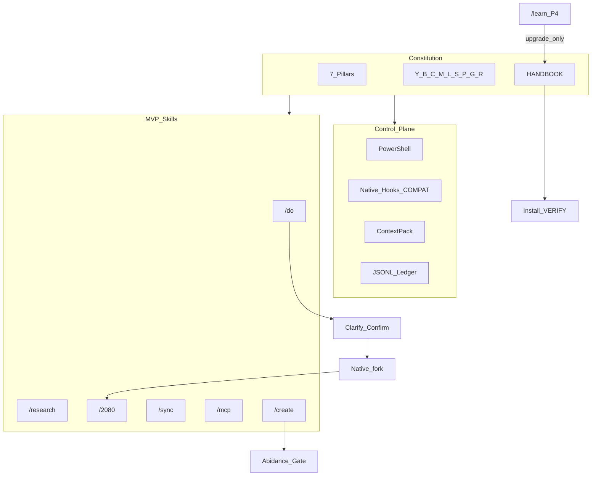

# Copilot Skills Pack — Final Implementation Plan

**Canonical architecture document (read first):**  
[copilot_skills_pack_ADR.md](C:\Users\avish\Documents\KnowledgeVault\outputs\copilot_skills_pack_ADR.md)  
— Solution Architecture · ADRs 001–014 · Constitution · Design · Appendices (N1–N7, O1–O9, Ponytail, DEFER)

| | |
|--|--|
| **Repo** | `C:\Users\avish\Documents\KnowledgeVault\projects\copilot-skills` |
| **Out of scope** | InstagramVault · ClaudeTrades |
| **MVP stop** | Phase 3 golden path → **STOP AND USE** |
| **Guide** | `docs/HANDBOOK.md` (AI + human VERIFY; `/learn` upgrade-only) |
| **Abidance** | All create/learn/2080/sync/handbook patches pass constitution |

---

## Architecture snapshot

**Conflict order:** correctness > thrift · safety > speed · evidence > hype · lean > completeness · native > custom · upgrade > silent overwrite.

---

## Constitution (summary — full text in ADR §3)

**Pillars:** (1) One SKILL.md standard (2) Code over vibes (3) Context thrift (4) Ask→confirm→finish (5) Parallel safe / sequential sacred (6) Measure→learn→promote upgrade-only (7) Secrets local  

**Principles:** Y essentials (Ponytail-inspired, no vendor) · B blocks · C caveman-accurate · M minimal · L lean · S slash · P professional · G growth · R root-cause  

**ADOPT:** N1–N7 native skills/hooks/plugins/fork/frontmatter/COMPAT/golden evidence  
**REJECT:** custom wave engines · body transforms · global instruction dumps · degrade promotes · vendored community runtimes  

---

## Key ADRs (pointers)

| ADR | Decision |
|-----|----------|
| 001 | Repo = KnowledgeVault `projects/copilot-skills` |
| 002 | Official SKILL.md; path adapters only |
| 003 | native > custom (N1–N7) |
| 004 | Layer A plugin or Layer B folders; VSIX DEFER |
| 005 | Dual gates; hooks ≠ gates |
| 006 | Native fork; depth one; no custom DAG |
| 007 | `/2080` multi-role; `/magic` DEFER |
| 008 | Model tip cards from official docs; restore model |
| 009 | Inject-only ContextPack; no always-on dumps |
| 010 | Upgrade-only learn + dual sync + error-map |
| 011 | Searchable JSONL ledger; OTel DEFER |
| 012 | Compact JSON MVP; TOON DEFER |
| 013 | `meta.json` + `skills.graph.json` |
| 014 | Living HANDBOOK with VERIFY/ON_FAIL |

---

## MVP command surface

| Full (Phase 2–3) | Stub→Phase 4 | DEFER |
|------------------|--------------|-------|
| `/do` `/research` `/2080` `/sync` `/mcp` `/create` | `/learn` `/stats` `/audit` | `/loop` `/magic` TOON REST custom-MCP VSIX |

**/do flow:** clarify → research → clarify → ShortPlan confirm → FullPlan + native parallel → `/2080` → handoff if token thresholds  

**/2080:** roles end-user · approver · architect · implementer → ≤ five recommendations + essentials ladder  

---

## Control plane

PowerShell Install/Sync/Mcp/ContextPack/Caveman/Repair + native hooks (COMPAT) + MCP profiles + JSONL ledger.  
Code owns paths/schemas/tests; AI owns judgment inside gates only.

---

## Handbook (Phase 0 skeleton → Phase 3 complete)

`docs/HANDBOOK.md`: install A/B · configure · golden path · troubleshoot · Agent contract (VERIFY/ON_FAIL).  
`/learn` kinds Phase 4: `handbook-fix|install|skill` — never remove VERIFY without replacement.

---

## Implementation phases

| Phase | Status | Deliver |
|-------|--------|---------|
| **0** | MUST | Repo · constitution · HANDBOOK skeleton · COMPAT · plugin stubs · ladder |
| **1** | MUST | PS control plane · hooks · ContextPack · ledger · L1 · install smoke |
| **2** | MUST | 6 full skills · shared gates · Layer A/B · abidance · graph |
| **3** | MUST → **STOP** | `/do`+/`research` native · model tips · `/2080` · **full HANDBOOK** · golden evidence |
| **4** | SHOULD | Full `/learn` · handbook patches · `/stats` `/audit` · dual sync PR |
| **5** | LEAN | `/loop` · `/magic` · wire stub · Linux wrappers |
| **6** | ACTIVE | `/moa` Mixture-of-Agents (MoA-Lite) — multi-proposer + aggregator |

**Phase 6 detail:** [docs/plan/PHASE6_MOA.md](PHASE6_MOA.md)

**Golden path:** HANDBOOK Agent contract → install → `/mcp minimal` → `/do` tiny → `/2080` → handoff → ledger (if hooks)

**User:** org plugin check · install once (or Copilot follows HANDBOOK) · `env/user.md`

---

## OPEN defaults (silent = accept)

O1 meta.json · O2 Copilot MVP / Claude folders / Cursor best-effort · O3 ContextPack PS · O4 handoff ask · O5 gates=process · O6 do.agent.md Phase 4 · O7 no marketplace · O8 tip-inject · O9 `/2080` four roles · handbook = `docs/HANDBOOK.md`

---

## Success (MVP)

Golden path green · constitution + abidance · 6+3 skills · `/2080` + model tips · hooks or COMPAT · inject-on-need · native parallel · `/sync -Check` · HANDBOOK VERIFY complete · no DEFER required

---

Say **`accept OPEN defaults`** or list overrides. Say **`execute the plan`** to start Phase 0.
