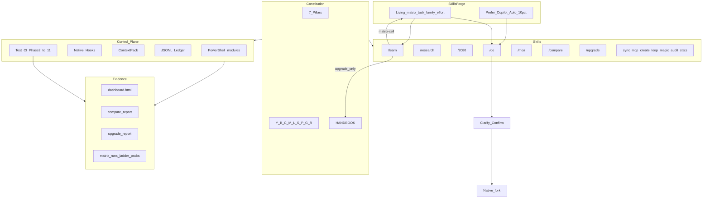

# SkillsForge — Living Implementation Plan

**Product:** SkillsForge · **Tagline:** 20% Change. 80% Better. · **Repo:** `copilot-skills`  
**Pack version:** 1.5.0-phase11 · **Guide:** [HANDBOOK](../HANDBOOK.md) · **Acceptance:** [ACCEPTANCE.md](../../ACCEPTANCE.md) · **Defer:** [DEFER.md](../DEFER.md)

**Purpose of this file:** Track **what exists now** (architecture as built), not only what the original MVP plan imagined.  
- `[x]` = done and in repo / CI  
- `[ ]` = not done, deferred, human, or constitution remediation still open  

**Abidance:** create / learn / 2080 / sync / handbook patches must pass the constitution. Later phases must be brought into the same bar (see § Constitution remediation).

---

## Architecture as built (current)



**Conflict order:** correctness > thrift · safety > speed · evidence > hype · lean > completeness · native > custom · upgrade > silent overwrite.

---

## Constitution (always on)

**Pillars:** (1) One SKILL.md standard (2) Code over vibes (3) Context thrift (4) Ask→confirm→finish (5) Parallel safe / sequential sacred (6) Measure→learn→promote upgrade-only (7) Secrets + personal data stay local  

**Principles:** Y essentials · B blocks · C caveman-accurate · M minimal · L lean · S slash · P professional · G growth · R root-cause  

**ADOPT:** N1–N7 native skills/hooks/plugins/fork/frontmatter/COMPAT/golden evidence  
**REJECT:** custom wave engines · body transforms · global instruction dumps · degrade promotes · vendored community runtimes · auto-scrape · required LLM judge as merge gate  

Full text: [PILLARS](../PILLARS.md) · [PRINCIPLES](../PRINCIPLES.md) · [ADR](ADR.md)

---

## ADR catalog (as built)

| ADR | Topic | Status |
|-----|-------|--------|
| 001–014 | Repo, SKILL, native, layers, gates, fork, 2080, tips, ContextPack, learn, ledger, wire, graph, HANDBOOK | Locked |
| 015 | Compare tracker (Phase 9) | Locked |
| 016 | Upgrade / frontier (Phase 10) | Locked |
| 017 | Living matrix + Auto prefer + quality escalate (Phase 11) | Locked |

---

## MVP + extended command surface

| Shipped | Role |
|---------|------|
| `/do` | Orchestrate; living matrix start (prefer **Copilot Auto**); escalate on fail **or** quality below min |
| `/research` | Depth-1 research |
| `/2080` | Multi-role review |
| `/sync` `/mcp` `/create` | Sync, MCP profiles, skill authoring |
| `/learn` | Upgrade-only promote (+ `matrix-cell`) |
| `/stats` `/audit` | Ledger stats / audit |
| `/loop` `/magic` | Iteration / 2080 alias |
| `/moa` | MoA-Lite proposers → aggregator |
| `/compare` | Harness vs solo evidence |
| `/upgrade` | Component + frontier inventory |

**/do flow (current):** Prep (matrix → Auto tip + effort) → clarify → research → ShortPlan confirm → implement (Auto first) → escalate if error/deny/**qualityBelow** (effort on Auto, then leave Auto, synth pack) → `/2080` → finish/restore  

---

## Control plane (shipped)

- [x] PowerShell modules: Install, Sync, ContextPack, Obs/ledger, Models, Ladder, Learn, MoA, Compare, Upgrade, Quality, Governance, Stats, Loop, …
- [x] Native hooks + COMPAT
- [x] MCP profiles (minimal default)
- [x] JSONL ledger (`logs/ledger/` — runtime, not for secrets)
- [x] GitHub Actions CI: InstallSmoke → Phase2 → GoldenPath → Phase4–**11**
- [x] Brand kit: SkillsForge (`brand/`)

---

## Phase checklist (built vs open)

### Phase 0 — Bootstrap

- [x] Repo under KnowledgeVault `projects/copilot-skills`
- [x] Constitution docs (PILLARS / PRINCIPLES)
- [x] HANDBOOK skeleton → later completed
- [x] COMPAT + plugin stubs + essentials ladder

### Phase 1 — Control plane

- [x] Install / Sync / Repair
- [x] Hooks + ContextPack + ledger
- [x] Install smoke

### Phase 2 — Core skills

- [x] Six full skills: do, research, 2080, sync, mcp, create
- [x] Skill packaging (SKILL.md, meta, README, SETUP, ACCEPTANCE)
- [x] `skills.graph.json` + Gate module + gate-flow
- [x] `Test-Phase2.ps1`

### Phase 3 — MVP STOP

- [x] Model tips + DoPrep/DoFinish
- [x] Handoff + session thresholds
- [x] Full HANDBOOK with VERIFY
- [x] Golden path evidence
- [ ] Human: real `/do` task in Copilot Chat

### Phase 4 — Learn / audit

- [x] Upgrade-only `/learn` + handbook kinds
- [x] `/stats` `/audit` + error-map shards
- [x] 2080 security + operator roles
- [x] `Test-Phase4.ps1`

### Phase 5 — Lean extras

- [x] `/loop` · `/magic` · WireFormat compact JSON · research depth · Linux wrappers · DEFER.md
- [x] `Test-Phase5.ps1`

### Phase 6 — MoA

- [x] `/moa` + MoA.psm1 + lite/full/research profiles
- [x] Proposer/aggregator agents + proposal pack
- [x] Compare-MoAToBaseline (stats-gated wire later)
- [x] PHASE6_MOA.md + `Test-Phase6.ps1`
- [ ] Constitution: clarify/confirm before MoA fork (or document explicit exception)
- [ ] Constitution: MoA wire evidence should prefer Phase 9 compare Elo/lift (not only ledger token median)

### Phase 7 — Governance

- [x] L1/L2/L3 gates · learn negatives · L2 promote gate
- [x] Local dashboard `evidence/dashboard.html`
- [x] PHASE7 + `Test-Phase7.ps1` in CI
- [ ] Constitution: L3 markers for compare/upgrade skills
- [ ] Constitution: pre-push secrets-audit script (Pillar 7)

### Phase 8 — ICS quality

- [x] Instruction Contract Score + baseline maxDrop
- [x] Promote quality gate for md paths
- [x] Optional quality-judge workflow (non-blocking)
- [x] PHASE8 + `Test-Phase8.ps1`
- [ ] Constitution: ICS cases for moa / compare / upgrade / matrix.json

### Phase 9 — Compare tracker

- [x] Elo / lift / cost · task cards · arms · `/compare`
- [x] Seed demo + report.html
- [x] PHASE9 + `Test-Phase9.ps1`
- [ ] Human: real multi-model compare runs
- [ ] Policy: gitignore or redaction rules for `evidence/compare/outputs/`

### Phase 10 — Upgrade / frontier

- [x] Upgrade.psm1 + registry + `/upgrade` + sources.json
- [x] Explicit scan, no auto-scrape
- [x] PHASE10 + `Test-Phase10.ps1`
- [ ] Human: periodic frontier research from report checklist

### Phase 11 — Living matrix (+ Auto discount)

- [x] Evidence runs `evidence/matrix/runs` (+ optional qualityScore)
- [x] Effort tips · synth packs · `/do` escalate
- [x] Prefer **Copilot Auto** (10% discount); raise Auto effort before leaving Auto
- [x] Escalate on **error/deny** OR **qualityBelow** (`qualityMin`)
- [x] `/learn` kind `matrix-cell` promote gate
- [x] PHASE11 + ADR-017 + `Test-Phase11.ps1`
- [ ] Human: record real cell outcomes so evidence can promote starts
- [ ] Constitution: route `Invoke-MatrixCellPromote` through L2 + ICS (+ dual-sync policy)
- [ ] Constitution: matrix promote considers avgQuality vs qualityMin (not only okRate)
- [ ] Docs: document `matrix-cell` in `skills/learn/SKILL.md` kinds list
- [ ] DEFER until needed: `/research`/`/loop` ladder hooks; auto IDE model switch

### Brand / packaging (post-phase)

- [x] SkillsForge name, logo, banner, README presentation
- [x] CI Node 24-native checkout/upload-artifact majors

---

## Constitution remediation backlog (Phases 6–11)

Later features mostly follow pillars (code over vibes, thrift, evidence before auto-wire, upgrade-only learn). Gaps to close so **everything** abides the same bar:

| ID | Gap | Apply to | Target |
|----|-----|----------|--------|
| C1 | MoA skips clarify→confirm | Phase 6 | `/moa` SKILL or ADR exception |
| C2 | MoA baseline ≠ compare Elo | Phase 6/9 | Wire or document single evidence path |
| C3 | Matrix-cell promote skips L2/ICS | Phase 11 | `Invoke-MatrixCellPromote` |
| C4 | ICS/L3 miss later skills | Phase 7/8 | fixtures + quality-gate globs |
| C5 | Matrix promote ignores quality | Phase 11 | `Test-MatrixCellPromoteGate` |
| C6 | Learn skill docs miss `matrix-cell` | Phase 11 | `skills/learn/SKILL.md` |
| C7 | No secrets-audit script | Pillar 7 | `scripts/` + handbook |
| C8 | Evidence output leak risk | Phase 9 | gitignore / redaction policy |

Track as todo `constitution-remediation` (pending). Prefer **20% changes**: C3+C6+C5 first (matrix promote path), then C4, then C1/C2/C7/C8.

---

## Deferred (pain only — unchecked)

See [DEFER.md](../DEFER.md). Still not built:

- [ ] VSIX / Layer C · OTel · REST UI · custom MCP · marketplace
- [ ] TOON-on · required LLM judge · auto-scrape sources
- [ ] Copilot-session auto-capture · auto-wire MoA from Elo
- [ ] Per-skill error-map directories · Auto IDE model switch API
- [ ] `/research` / `/loop` full living-matrix hooks

---

## Human evidence loops (unchecked)

- [ ] Phase 3: real `/do` in Copilot Chat  
- [ ] Phase 9: real multi-model compare runs  
- [ ] Phase 10: periodic `/upgrade` research  
- [ ] Phase 11: real Auto/effort cell outcomes → promote  

---

## CI (current)

```text
InstallSmoke → Phase2 → GoldenPath → Phase4 → Phase5 → Phase6
→ Phase7 → Phase8 → Phase9 → Phase10 → Phase11 → dashboard
```

Local: `.\scripts\Test-CI.ps1` · Docs: [CI.md](../CI.md)

**Phase plan docs:** [PHASE6](PHASE6_MOA.md) · [PHASE7](PHASE7_GOVERNANCE.md) · [PHASE8](PHASE8_QUALITY_GATE.md) · [PHASE9](PHASE9_COMPARE_TRACKER.md) · [PHASE10](PHASE10_UPGRADE.md) · [PHASE11](PHASE11_LIVING_MATRIX.md)

---

## Success criteria

### MVP (Phase 3) — achieved

- [x] Golden path green · constitution + abidance · core skills · `/2080` + tips · inject-on-need · native parallel · HANDBOOK VERIFY  

### Extended (Phases 4–11) — achieved at lean bar

- [x] Learn / MoA / governance / ICS / compare / upgrade / living matrix+Auto  
- [ ] Constitution remediation C1–C8 closed  
- [ ] Human evidence loops filled  

---

## How to use this plan

1. Treat **checked** items as current architecture truth.  
2. Plan sprints from **unchecked** sections: constitution remediation → human evidence → DEFER only on pain.  
3. When shipping remediation, check the box here **and** ACCEPTANCE.md in the same PR.  
4. Do not re-open completed phases unless a remediation row requires it.
