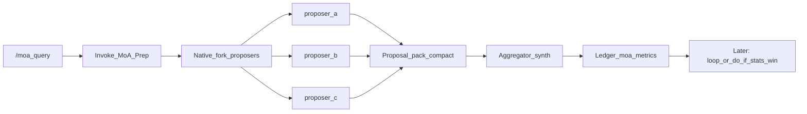

# Phase 6 — Mixture of Agents (`/moa`)

**Status:** ACTIVE  
**Command:** `/moa`  
**Goal:** Better output than one large model at lower cost — fan-out cheaper proposers in parallel, synthesize with one aggregator.

## Research base (inspire — do not vendor)

| Source | Takeaway |
|--------|----------|
| [togethercomputer/MoA](https://github.com/togethercomputer/moa) (Apache-2.0) | Proposers answer in parallel → aggregator synthesizes. MoA-Lite = 2 layers, cheaper than GPT-4o class with better AlpacaEval quality. |
| Wang et al. [arXiv:2406.04692](https://arxiv.org/abs/2406.04692) | Collaborativeness: LLMs improve when given other models' answers as reference. |
| Faster-MoA / tree MoA | Early-exit & tree routing = DEFER (serving infra). We keep flat MoA-Lite. |
| Small-agent orchestration papers | Quality is planner/aggregator-limited more than proposer-size-limited. |

**Conflict rule:** native fork > custom wave engine. Config > hardcode. Measure via ledger before wiring into `/do` or `/loop`.

## Architecture (ours)

| Layer | Deterministic code | AI |
|-------|-------------------|-----|
| Prep | Load profile, build prompts, session id, budget | — |
| Propose | — | Native fork / parallel workers per proposer tip card |
| Pack | Compact JSON envelope; caveman-trim proposals | — |
| Aggregate | Inject aggregator system prompt + packed refs | One aggregator model synthesizes |
| Measure | Ledger: proposers, tokens_est, profile, latency | — |

## Config

- `config/moa/profiles.json` — `lite` (default), `full`
- Proposers = cheaper / diverse tip families
- Aggregator = slightly stronger tip family (still not always top-tier)
- Caps: max proposers, max proposal chars, max layers (MVP = 1 propose + 1 aggregate)

## Wiring later (stats-gated)

After `/stats` / `/audit` show MoA win rate / token savings vs single-model `/do`:

1. Add `"moa"` to `config/loop.json` steps (optional)
2. `/do` Gate 4 optional `delegatesTo: moa` for hard judgment tasks
3. `/research` depth-1 fan-out can use MoA profile `research`

Until then: **standalone `/moa` only**.

## Non-goals

- Vendoring Together runtime or API keys as required
- Background MoA daemon
- 3+ dense layers by default (cost explosion)
- Auto-replace `/do` without evidence
